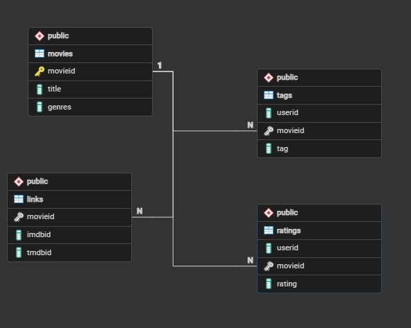
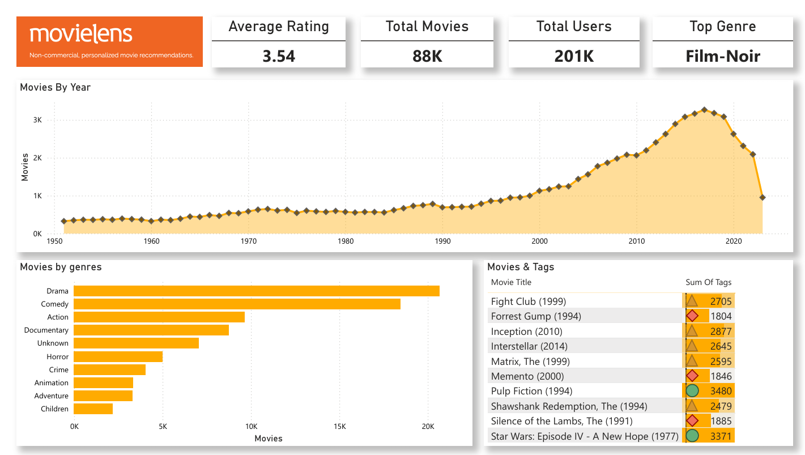
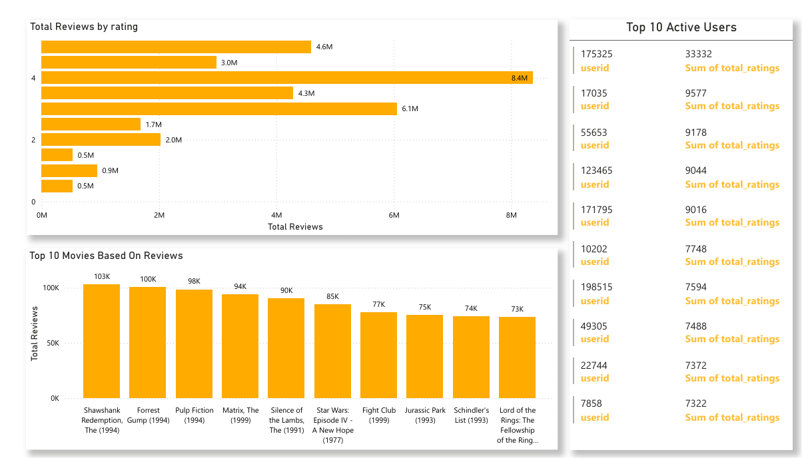
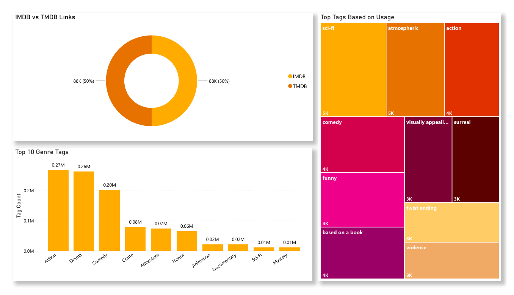

# 🎬 MovieLens Data Analysis & Power BI Dashboard

## 📌 Project Overview

This project analyzes the MovieLens dataset using SQL and Power BI to uncover trends in movie ratings, user engagement, genre popularity, and content growth over time.

The project demonstrates an end-to-end Data Analytics workflow, including:

- Database Design
- SQL Data Cleaning & Transformation
- Exploratory Data Analysis (EDA)
- Business Intelligence Reporting
- Interactive Power BI Dashboard Development
- Insight Generation & Storytelling

---

## 🛠 Tools & Technologies

- PostgreSQL
- SQL
- Power BI
- Excel
- Git & GitHub

---

## 📂 Dataset Overview

The MovieLens dataset contains movie metadata, user ratings, tags, and external movie references.

### Tables Used

| Table | Description |
|---------|------------|
| Movies | Movie information and genres |
| Ratings | User ratings for movies |
| Tags | User-generated movie tags |
| Links | IMDb and TMDb identifiers |

### Platform Scale

| Metric | Value |
|----------|----------|
| Total Movies | 88K+ |
| Total Users | 201K+ |
| Average Rating | 3.54 |
| IMDb Links | 88K |
| TMDb Links | 88K |

---

## 🗄 Database Design

The database was designed using an Entity Relationship (ER) Model to establish relationships between movies, ratings, tags, and external movie references.

### ER Diagram



### Database Schema

```text
Movies
│
├── Ratings
│
├── Tags
│
└── Links
```

### Key SQL Tasks Performed

- Table Creation
- Primary & Foreign Key Implementation
- Data Validation
- Missing Value Handling
- Duplicate Detection
- Release Year Extraction
- Data Cleaning & Transformation
- Analytical Querying
- View Creation

---

## 🧹 Data Cleaning & Preparation

The following preprocessing steps were performed before analysis:

- Removed unnecessary columns
- Checked for missing values
- Validated table relationships
- Handled null values
- Checked for duplicate records
- Extracted release years from movie titles
- Standardized genre information
- Created relational links between datasets
- Verified data consistency across all tables

---

## 📊 SQL Analysis Performed

### Dataset Overview

- Total Movies
- Total Ratings
- Total Users
- Average Rating

### Movie Analysis

- Top Rated Movies
- Most Reviewed Movies
- Movies by Release Year
- Decade-wise Movie Trends

### Genre Analysis

- Genre Popularity
- Genre Performance
- Genre Rating Comparison

### User Analysis

- Most Active Users
- Rating Distribution
- User Engagement Patterns

### Reporting

- Summary Views
- Aggregated Reporting Tables
- Dashboard-ready Datasets

---

# 📈 Power BI Dashboard

The Power BI dashboard provides interactive insights into platform performance, movie trends, and user engagement.

---

## Executive Dashboard



### Features

- Total Movies
- Total Users
- Average Rating
- Platform Summary Metrics

---

## Content Analytics Dashboard



### Features

- Movies by Year
- Genre Distribution
- Genre Performance
- Historical Content Growth

---

## User Engagement Dashboard



### Features

- Rating Distribution
- Most Active Users
- Most Reviewed Movies
- Tag Activity Analysis

---

# 🔍 Key Insights

## Executive Summary & Platform Overview

The dashboards showcase a substantial dataset spanning more than seven decades of cinema history, capturing user ratings, movie metadata, and semantic tagging behavior.

### Platform Scale

- 88K+ total movies
- 201K+ unique users
- Average platform rating: **3.54**

### Quality Benchmark

The platform maintains a generally positive rating culture while still reflecting critical user evaluation.

### Highest Rated Genre

🏆 **Film-Noir** emerges as the highest-rated genre overall, demonstrating strong appreciation for classic cinema.

---

## 📈 Content Volume & Historical Trends

### Steady Growth (1950–1990)

Movie volume remained relatively stable, with annual releases staying below 1,000 movies.

### Content Boom (1990–2016)

The dataset shows significant expansion beginning in the 1990s, reaching a peak of more than 3,000 movies around 2016.

### Recent Decline (2016–Present)

Movie counts decrease sharply after 2016, likely due to incomplete recent data or stricter inclusion criteria.

---

## 🎭 Genre & Tagging Ecosystem

### Production Leaders

| Genre | Approximate Volume |
|---------|------------------|
| Drama | 20K+ Movies |
| Comedy | 18K+ Movies |
| Action | 10K+ Movies |

### The Action Paradox

Although Action ranks third by movie count, it generates the highest user interaction.

- Action Tags: 270K+
- Highest user engagement among all genres

This suggests Action movies encourage significantly more user participation than other genres.

---

## 🏷 Semantic Tag Analysis

The most frequently used user tags include:

- Sci-Fi
- Atmospheric
- Action
- Based on a Book
- Twist Ending
- Visually Appealing
- Surreal

These tags indicate that users frequently classify movies based on themes, storytelling elements, and viewing experiences.

---

## 👥 User Engagement & Rating Behavior

### Rating Distribution

The platform exhibits a strong positivity bias.

| Rating | Reviews |
|----------|-----------|
| 4.0 | 8.4M |
| 3.0 | 5.1M |
| 5.0 | 4.6M |

Lower ratings are comparatively rare, suggesting users tend to rate movies they already expect to enjoy.

---

### Power Users Drive Engagement

The most active user contributed:

**33,332 ratings**

This is more than three times the contribution of the second most active user.

### Insight

A relatively small group of highly active users contributes a significant portion of overall platform engagement.

---

## 🏆 Most Reviewed Movies

User activity is heavily concentrated around a small set of iconic films.

| Movie | Reviews |
|---------|-----------|
| The Shawshank Redemption (1994) | 103K |
| Forrest Gump (1994) | 100K |
| Pulp Fiction (1994) | 98K |
| The Matrix (1999) | 94K |

### Key Observation

The year **1994** dominates platform engagement, with multiple highly reviewed movies originating from that period.

---

## 🔗 Metadata Quality & Integrity

### External Database Mapping

The IMDb vs TMDb mapping analysis reveals:

- 88K IMDb Links
- 88K TMDb Links

### Data Completeness

Every movie record is successfully linked to both external databases.

### Business Value

This allows seamless integration with:

- Recommendation Systems
- Machine Learning Models
- External APIs
- Advanced Analytics Pipelines

---

# 🚀 Skills Demonstrated

### SQL

- Joins
- Aggregations
- Group By
- Data Cleaning
- Data Validation
- Views

### Data Analytics

- Exploratory Data Analysis (EDA)
- Trend Analysis
- User Behavior Analysis
- Genre Analysis
- Insight Generation

### Power BI

- Dashboard Development
- KPI Design
- Interactive Visualizations
- Data Storytelling

### Database Design

- ER Modeling
- Relational Database Design
- Primary & Foreign Keys

---

# 👨‍💻 About Me

Hi, I'm **Raghuram Beldon**.

An aspiring Data Analyst passionate about transforming raw data into actionable business insights through SQL, Power BI, Excel, and Python.

### Skills

- SQL
- Power BI
- Excel
- Python
- Data Visualization
- Business Intelligence
- Data Cleaning
- Data Analysis

### Portfolio

🌐 https://raghurambeldon-portfolio.netlify.app/

### GitHub

🌐 https://github.com/Raghurambeldon

### LinkedIn

https://www.linkedin.com/in/beldon-raghuram-73a2b22b1/

---
# 📚 Dataset Source

This project uses the MovieLens dataset provided by the GroupLens Research Lab at the University of Minnesota.

Dataset Link:

https://grouplens.org/datasets/movielens/

### About MovieLens

MovieLens is one of the most widely used datasets for data analytics, recommendation systems, machine learning, and data science projects. It contains movie metadata, user ratings, tags, and external movie references collected from the MovieLens platform.

Dataset Provider:
GroupLens Research Lab, University of Minnesota

---
⭐ If you found this project interesting, consider starring the repository. Feedback and collaboration opportunities are always welcome.
